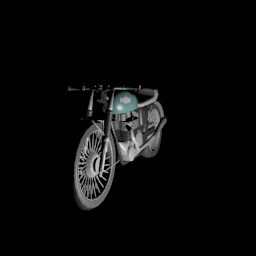
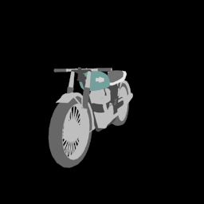
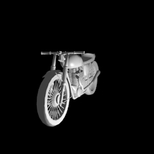
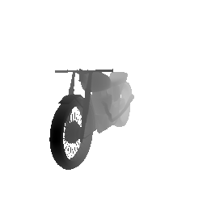
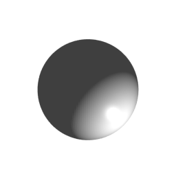
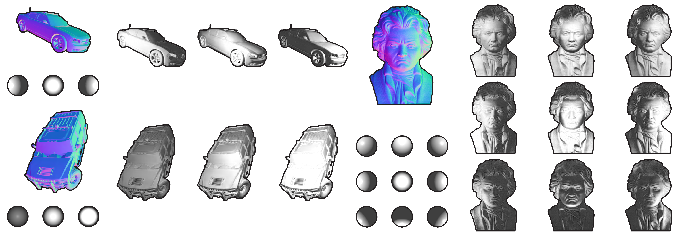

# Rendered Intrinsics Network
Code and data to reproduce the experiments in [Self-Supervised Intrinsic Image Decomposition](http://people.csail.mit.edu/janner/papers/intrinsic_nips_2017.pdf).

<p align="center">
    
</p>

## Installation
Get [PyTorch](http://pytorch.org/) and `pip install -r requirements`

You will also need [Blender](https://www.blender.org/) (2.76+) and the [ShapeNet](https://www.shapenet.org/) repository. In `config.py`, replace these lines:
```
blender = '/om/user/janner/blender-2.76b/blender'
shapenet = '/om/data/public/ShapeNetCore.v1'
```
with the absolute paths to the Blender app and the ShapeNet library on your machine. The Blender-supplied Python might not come with numpy and scipy. You can either fulfill the same requirements with the Blender Python or replace `include` with a directory containing those libraries. 

## Data

All of the code to render the training images is in `dataset`. 
1. Make an array of lighting conditions with `python make_array.py --size 20000`. See the parser arguments for lighting options. An array with the defaults is already at `dataset/arrays/shader.npy`.
2. `python run.py --category motorbike --output output/motorbike --low 0 --high 100 --repeat 5` will render 100 composite motorbike images (numbered 0 through 100) along with the corresponding images. It will reuse a given motorbike model 5 times before loading a new one. (Images of the same model will differ in orientation and lighting.) 

The saved images in `dataset/output/motorbike/` should look something like this:

<p align="center">
    
    
    
    
    
     
</p>
<p align="center">
    <em> A motorbike with its reflectance, shading, and normals map. The lighting conditions are visualized on a sphere.</em>
</p>

The available ShapeNet categories are given in `config.py`. There are also a few geometric primitives (`cube`, `sphere`, `cylinder`, `cone`, `torus`) and standard test shapes (Utah `teapot`, Stanford `bunny`, Blender's `suzanne`). If you want to render other categories from ShapeNet, just add its name and ID to the dictionary in `config.py` and put the location, orientation, and size parameters in `dataset/utils.py`.

#### Batching
Since rendering can be slow, you might want to render many images in parallel. If you are on a system with SLURM, you can use `divide.py`, which works like `run.py` but also has a `--divide` argument to launch a large rendering job as many smaller jobs running concurrently.

#### Download
We also provide a few of the datasets for download if you do not have Blender or ShapeNet. 
```
./download_data.sh { motorbike | airplane | bottle | car | suzanne | teapot | bunny }
``` 
will download train, val, and test sets for the specified category. There is about 2 GB of data for each of the ShapeNet categories and 200 MB for the test shapes. 

## Shader

<p align="center">
    
</p>
<p align="center">
    <em> Example input shapes and lighting conditions alongside the model's predicted shading image. After training only on synthetic cars like those on the left, the model can generalize to images like the real Beethoven bust on the right.</em>
</p>

To train a differentiable shader:
```
python shader.py --data_path dataset/output --save_path saved/shader --num_train 10000 --num_val 20 \
		 --train_sets motorbike_train,airplane_train,bottle_train \
		 --val_set motorbike_val,airplane_val,bottle_val
```
where the train and val sets are located in `--data_path` and were rendered in the previous step. The script will save visualizations of the model's predictions on the validation images every epoch and save them to `--save_path` along with the model itself. Note that `--num_train` and `--num_val` denote the number of images <i>per dataset</i>, so in the above example there will be 30000 total training images and 60 validation images.

## Intrinsic image prediction

```
python decomposer.py --data_path dataset/output --save_path saved/decomposer --array shader --num_train 20000 \
		     --num_val 20 --train_sets motorbike_train --val_set motorbike_val
```

will train a model on just motorbikes, although you can specify more datasets with a comma-separated list (as shown for the `shader.py command`). The rest of the options are analogous as well except for `array`, which is the lighting parameter array used to generate the data. The script will save the model, visualizations, and error plots to `--save_path`.

## Transfer
After training a decomposer and shader network, you can compose them to improve the representations of the decomposer using unlabeled data. If you have trained a decomposer on only the geometric shape primitives, and now wanted to transfer it to the test shapes, you could use:
```
python composer.py --decomposer saved/decomposer/state.t7 --shader saved/shader.t7 --save_path saved/composer \
		   --unlabeled suzanne_train,teapot_train,bunny_train \
		   --labeled cube_train,sphere_train,cylinder_train,cone_train,torus_train \
		   --val_sets suzanne_val,teapot_val,bunny_val,cube_val,sphere_val \
		   --unlabeled_array unlab_shader --labeled_array lab_shader \
		   --transfer 300_normals --num_epochs 300 --save_model True 
```
where `--labeled` contains the labeled datasets and `--unlabeled` the unlabeled datasets. The `--val_sets` are used to make visualizations after every epoch. (It is useful to have some of the labeled datasets in the visualization as well as a sanity check.) The `--array` flags are the names of the arrays with lighting parameters. Using the above rendering examples, this would be `shader`. `--decomposer` and `--shader` point to the saved networks trained in the previous steps.

`--transfer` is the most important flag. It specifies a training schedule for the network, of the form `<iters>_<params>,<iters>_<params>,...`. For example, `10_shader,10_normals,reflectance,20_lights` will train only the shading parameters for 10 epochs, then only the parameters of the reflectance and normals decoders for 10 epochs, and then the lighting deocoder for 20 epochs. This 40-epoch cycle will continue for `--num_epochs` epochs.

