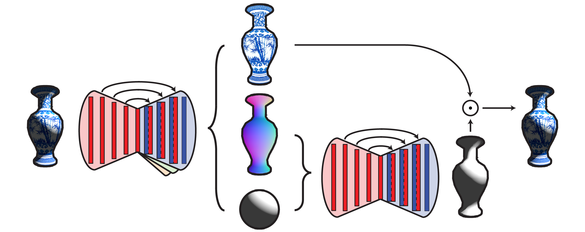
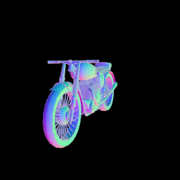

# Rendered Intrinsics Network
Code and data to reproduce the experiments in [Self-Supervised Intrinsic Image Decomposition](http://people.csail.mit.edu/janner/papers/intrinsic_nips_2017.pdf).

<p align="center">
    
</p>

## Installation
Get [PyTorch](http://pytorch.org/) and `pip install -r requirements`

You will need [Blender](https://www.blender.org/) (2.76+) and the [ShapeNet](https://www.shapenet.org/) repository. In `config.py`, replace these lines:
```
blender = '/om/user/janner/blender-2.76b/blender'
shapenet = '/om/data/public/ShapeNetCore.v1'
```
with the absolute paths to the Blender app and the ShapeNet library on your machine.  

If you don't want to render your own datasets, `./download_data.sh` to get the annotated map data and sprites to make new maps.

## Data

All of the code to render the training images is in `dataset`. 
1. Make an array of lighting conditions with `python make_array.py --size 20000`. See the parser arguments for lighting options. An array with the defaults is already at `dataset/arrays/shader.npy`.
2. `python run.py --category car --output output/car --low 0 --high 100 --repeat 5` will render 100 composite car images (numbered 0 through 100) along with the corresponding images. It will reuse a given car model 5 times before loading a new one. (Images of the same model will differ in orientation and lighting.) The available categories are given in `config.py`.

The saved images in `dataset/output/car/` should look something like this:

<p align="center">
    
    
    
    
    
    
</p>
<p align="center">
    <em> A car with its reflectance, shading, and normals map. The lighting conditions are visualized on a sphere.</em>
</p>

Since rendering can be slow, you might want to render many images in parallel. If you use SLURM, you can use `divide.py`, which works like `run.py` but also has a `--divide` argument to launch a large rendering job as many smaller jobs running concurrently.

## Shader

<p align="center">
    
</p>
<p align="center">
    <em> Example input shapes and lighting conditions alongside the model's predicted shading image. After training only on synthetic cars like those on the left, the model can generalize to images like the real Beethoven bust on the right.</em>
</p>

To train a differentiable shader:
```
python shader.py --data_path dataset/output --save_path saved/shader --num_train 10000 --num_val 20 \
		 --train_sets motorbike_train,airplane_train,bottle_train \
		 --val_set motorbike_val,airplane_val,bottle_val
```
where the train and val sets are located in `data_path` and were rendered in the previous step. The script will save visualizations of the model's predictions on the validation images every epoch and save them to `save_path` along with the model itself. Note that `num_train` and `num_val` denote the number of images <i>per dataset</i>, so in the above example there will be 30000 total training images and 60 validation images.

## Intrinsic image prediction

```
python decomposer.py --data_path dataset/output --save_path saved/decomposer --array shader --num_train 20000 \
		     --num_val 20 --train_sets motorbike_train, --val_set motorbike_val
```

will train a model on just motorbikes, although you can specify more datasets as with `shader.py`. The rest of the options are analogous as well except for `array`, which is the lighting parameter array used to generate the data. The script will save the model, visualizations, and error plots to `save_path`.

## Transfer
Coming soon. If you are comfortable with Lua, check out `lua/composer.lua`. 

